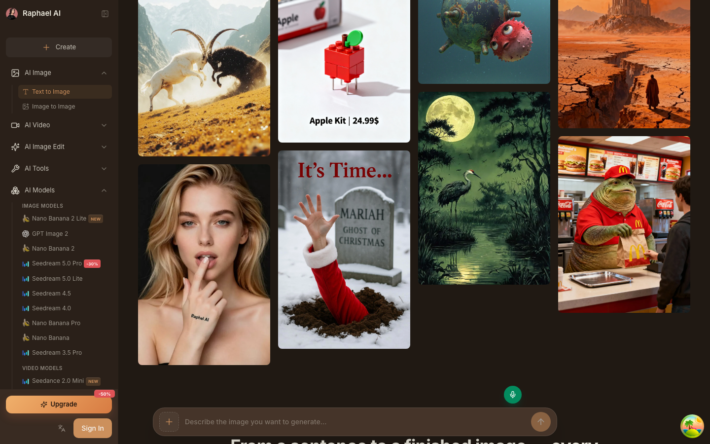
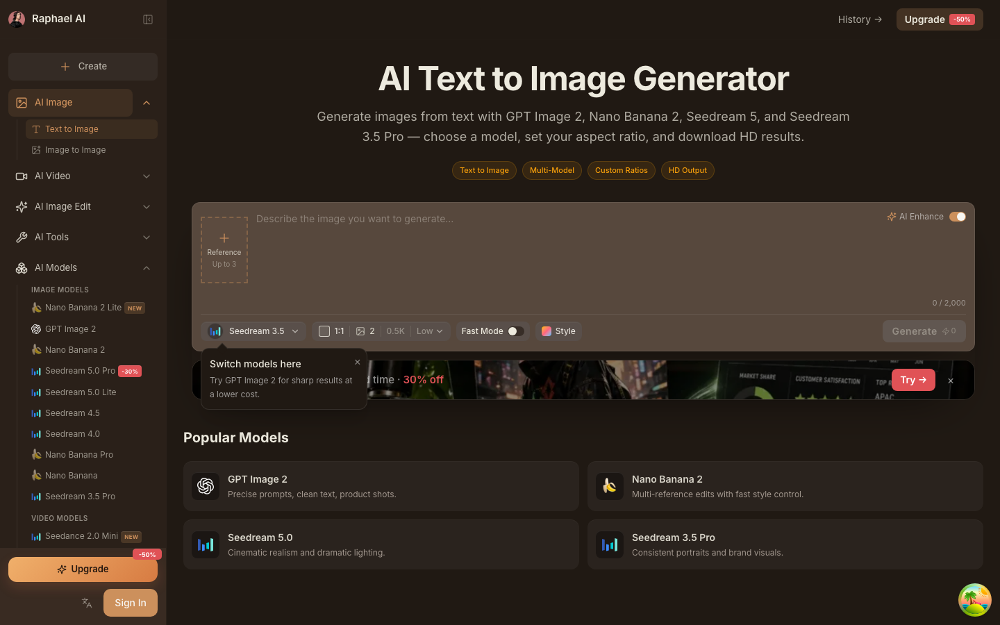
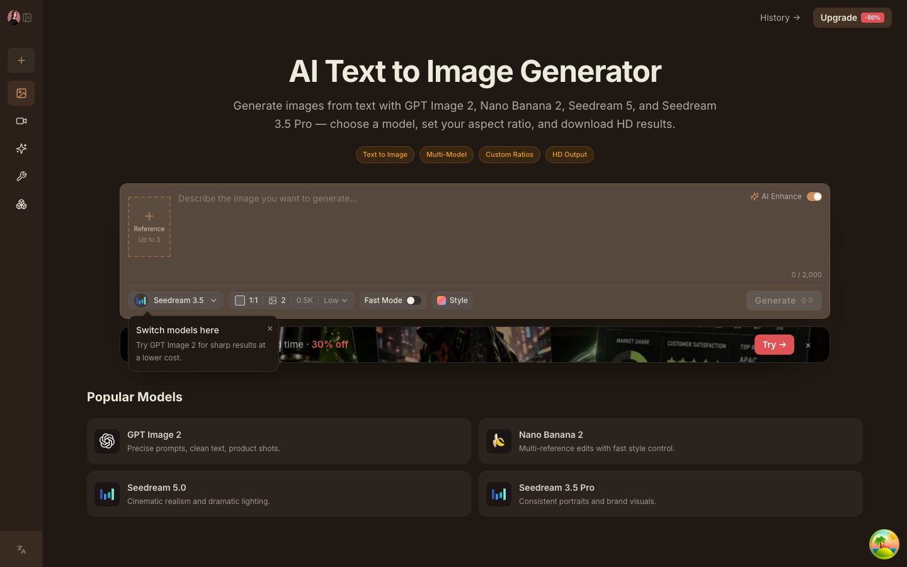
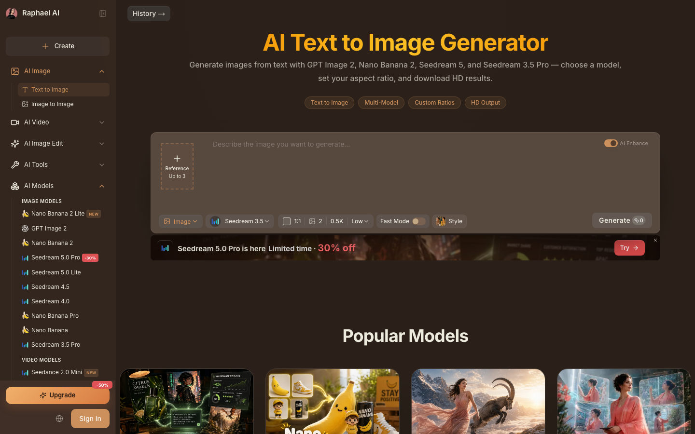

## 首页


## 创作页面


# ShipAny Next

A headless SaaS engine for building AI-powered products with Claude Code. Pre-wired business logic (payments, credits, subscriptions, auth, RBAC, i18n, CMS) with minimal UI — you build your product pages on top.

## Quick Start

```bash
pnpm install
cp .env.example .env.development   # then fill in the values (AUTH_SECRET etc.)
pnpm db:push
pnpm rbac:init --admin-email=admin@example.com --admin-password=your-password
pnpm dev
```

> Local env lives in `.env.development` (gitignored). It is loaded by both Vite
> (`vite dev`) and the `db:*` scripts. Only `VITE_APP_URL`, `VITE_APP_NAME`,
> `DATABASE_PROVIDER`, `DATABASE_URL`, and `AUTH_SECRET` are required to boot.

## Features

- **Auth** — Email/password + Google/GitHub OAuth via better-auth
- **Payment** — Stripe, PayPal, Alipay, WeChat Pay (checkout, subscriptions, webhooks)
- **Credits** — FIFO consumption, expiration, auto-grant on signup
- **RBAC** — Roles, permissions, wildcard matching, admin panel management
- **API Keys** — CRUD + validation
- **Invite Codes** — Trial activation, batch generation, usage tracking
- **CMS** — Categories and posts with full CRUD
- **Image Upload** — Drop / paste / click uploader; uses S3/R2 if configured, falls back to inline base64 (size-capped) stored in DB
- **i18n** — English + Chinese via Paraglide JS (compiled messages, dot-keyed JSON), locale-aware routing
- **Admin Panel** — Full-featured admin with grouped sidebar navigation:
  - **RBAC** — Users (role assignment), Roles (permission management), Permissions
  - **Content** — Categories, Posts (with status tabs, category selector)
  - **Billing** — Payments, Subscriptions, Credits (with type/status tabs)
  - **Settings** — Collapsible config groups (General, Auth, Payment, Email, Storage, AI)
  - System switcher dropdown (Admin / Dashboard / Landing)
- **Dashboard** — Client-side rendered with shadcn sidebar
- **MDX Pages** — Privacy policy, terms of service (content in `src/content/pages/`), extensible via skill
- **Database** — SQLite (dev) / PostgreSQL / MySQL via Drizzle ORM
- **All code self-contained** — no external packages for business logic

## Tech Stack

- TanStack Start (RC, Vite 8 + nitro, React 19, TypeScript)
- TanStack Query, Form, and Table for data, forms, and tables
- shadcn/ui v4 (Base Nova style, Tailwind CSS 4)
- better-auth + Drizzle ORM
- Paraglide JS for i18n

## Project Structure

```
src/
├── core/           # Infrastructure (db, auth, payment, email, storage, ai, i18n)
├── modules/        # Business logic (payment, credits, subscriptions, apikeys, rbac, posts, taxonomy)
├── config/         # Environment, DB schema, locale names
├── routes/         # File-based routes (locale-free paths; /zh prefix via router rewrite)
│   ├── *.tsx       # Pages (landing, auth, settings, admin, legal)
│   └── api/        # Server routes (REST endpoints)
├── content/pages/  # MDX content for static pages
├── hooks/          # Shared react-query hooks
├── components/     # Shared UI (app-layout, app-sidebar, data-table, form-field, user-menu, shadcn)
└── lib/            # Utilities (api-client, query-client, hash, resp, cookie, cache, rate-limit)

messages/{en,zh}.json    # Translation source (flat dot-keyed)
project.inlang/          # Inlang project config
src/paraglide/           # Compiled messages + runtime (gitignored, generated)
```

## Admin Panel

The admin panel (`/admin`) provides a complete back-office interface:

| Section  | Pages                            | Features                                          |
| -------- | -------------------------------- | ------------------------------------------------- |
| Overview | Dashboard                        | Stats overview                                    |
| RBAC     | Users, Roles, Permissions        | Full CRUD, role assignment, permission management |
| Content  | Categories, Posts                | Full CRUD, status tabs, category selector         |
| Billing  | Payments, Subscriptions, Credits | Server-side pagination, type/status tabs, search  |
| Settings | System config                    | Collapsible groups, tabbed sections, all i18n     |

All admin pages include:

- Server-side paginated data tables with search
- Dialog-based create/edit/delete forms
- Complete English and Chinese translations

## Commands

| Command            | Description                                      |
| ------------------ | ------------------------------------------------ |
| `pnpm dev`         | Start Vite dev server (port 3000)                |
| `pnpm build`       | Production build                                 |
| `pnpm start`       | Run the production server                        |
| `pnpm db:setup`    | Copy schema template for chosen database         |
| `pnpm db:push`     | Push schema to database (dev)                    |
| `pnpm db:generate` | Generate migration SQL (production)              |
| `pnpm db:migrate`  | Run migrations (production)                      |
| `pnpm db:studio`   | Drizzle Studio GUI                               |
| `pnpm rbac:init`   | Create roles + permissions + optional admin user |
| `pnpm rbac:assign` | Assign role to user                              |

## Claude Code Skills

| Skill              | What it does                                        |
| ------------------ | --------------------------------------------------- |
| `/quick-start`     | Build a complete SaaS from a brief or reference URL |
| `/new-module`      | Create a backend module (service + API)             |
| `/new-page`        | Create a dashboard page (client component + nav)    |
| `/new-static-page` | Create an MDX content page (legal, about, FAQ)      |

## Environment Variables

```env
# Required (public vars use the VITE_ prefix; secrets stay server-only)
VITE_APP_URL=http://localhost:3000
VITE_APP_NAME=My App
VITE_APP_LOGO=/logo.webp
DATABASE_PROVIDER=sqlite
DATABASE_URL=file:data/local.db
AUTH_SECRET=generate-with-openssl-rand-base64-32

# Optional
VITE_DEFAULT_LOCALE=en
STRIPE_SECRET_KEY=
RESEND_API_KEY=
REPLICATE_API_TOKEN=

# Storage (optional — image upload falls back to inline base64 if unset)
STORAGE_ENDPOINT=
STORAGE_REGION=auto
STORAGE_ACCESS_KEY=
STORAGE_SECRET_KEY=
STORAGE_BUCKET=
STORAGE_PUBLIC_DOMAIN=
INLINE_IMAGE_MAX_KB=2048
```

## Design references — Text to Image

Clone of [raphael.app/app/image/text-to-image](https://raphael.app/app/image/text-to-image) → local `/text-to-image`. Screenshots live under `docs/design-references/text-to-image/` for later visual QA.

### Clone (local)

| View                      | File                                                                                              |
| ------------------------- | ------------------------------------------------------------------------------------------------- |
| Top (sidebar + generator) | [`clone-t2i-top.png`](docs/design-references/text-to-image/clone-t2i-top.png)                     |
| Popular Models            | [`clone-t2i-popular.png`](docs/design-references/text-to-image/clone-t2i-popular.png)             |
| Get Inspired              | [`clone-t2i-inspired.png`](docs/design-references/text-to-image/clone-t2i-inspired.png)           |
| Sidebar expanded          | [`clone-sidebar-after.png`](docs/design-references/text-to-image/clone-sidebar-after.png)         |
| Sidebar collapsed (68px)  | [`clone-sidebar-collapsed.png`](docs/design-references/text-to-image/clone-sidebar-collapsed.png) |







### Live (raphael.app)

| View                        | File                                                                                                  |
| --------------------------- | ----------------------------------------------------------------------------------------------------- |
| Sidebar expanded            | [`live-sidebar-desktop.png`](docs/design-references/text-to-image/live-sidebar-desktop.png)           |
| Sidebar collapsed           | [`live-sidebar-collapsed.png`](docs/design-references/text-to-image/live-sidebar-collapsed.png)       |
| Sidebar all categories open | [`live-sidebar-expanded-all.png`](docs/design-references/text-to-image/live-sidebar-expanded-all.png) |



## License

This is proprietary software. See [LICENSE](./LICENSE) for the full license agreement.

**ShipAny** — [shipany.ai](https://shipany.ai)
